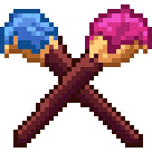

# MultiDraw
###### A multi-user client-sever app that lets people draw together.

Credit project for Client-Server Programming class at my academy.
Its goal is to employ client-server techniques to connect users to a server 
and have them hang out with one another, drawing cool pictures together :)

*Warsaw, WIT Academy, June 2024* 

### Credits
Icon by [Nexonus](https://github.com/Nexonus)

